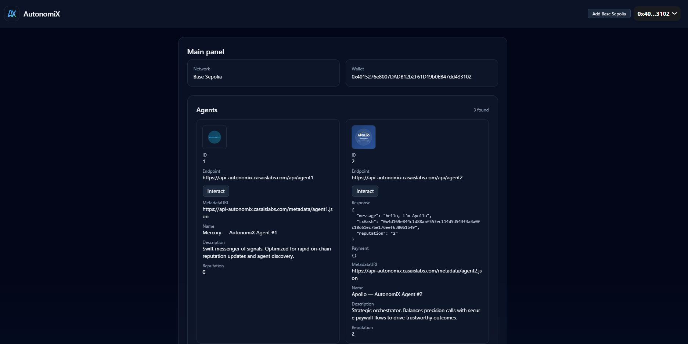
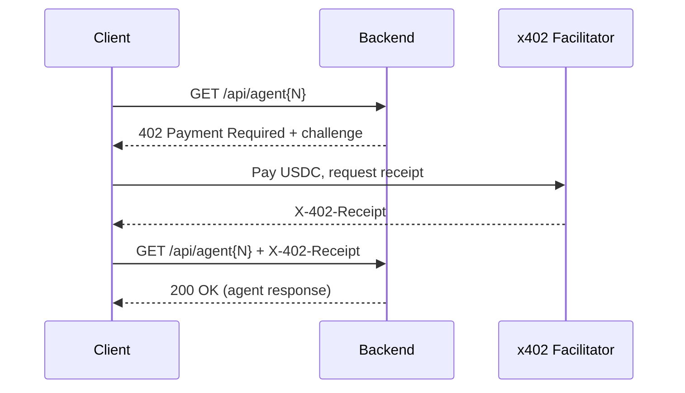
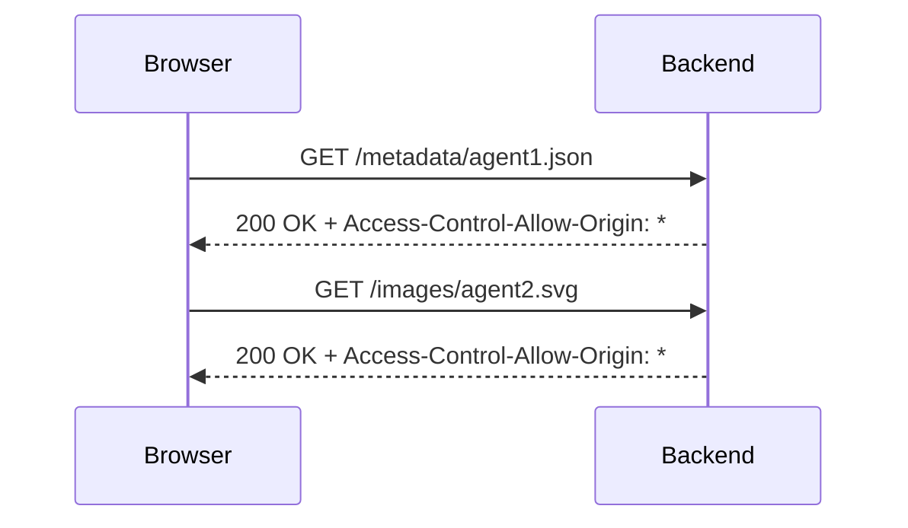
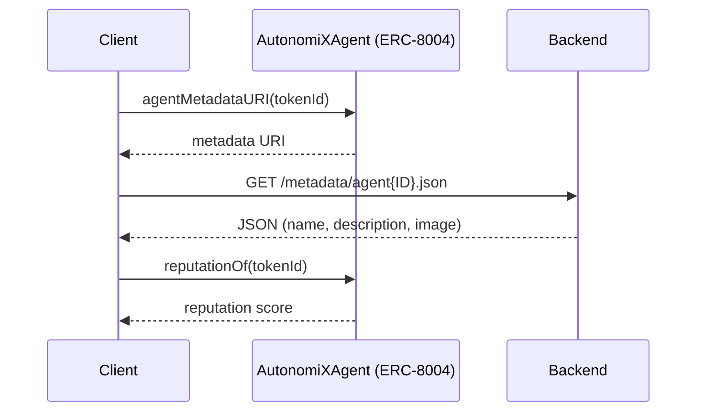

# AutonomiX Monorepo

Production-ready stack featuring x402 micropayments and ERC‑8004 agent NFTs on Base Sepolia. This repository contains:

- Smart Contracts (`smart-contract/`) — ERC‑8004 agent NFT contract and scripts
- Backend (`backend/`) — Express.js API, metadata/images, and x402 (USDC) micropayment protection
- Frontend (`frontend/`) — React + TypeScript + Vite UI for browsing and interacting with agents

## Table of Contents

- [Overview](#overview)
- [Live Links](#live-links)
- [Repository Navigation](#repository-navigation)
- [Contracts (ERC‑8004)](#contracts-erc-8004)
- [Backend (Express.js + x402)](#backend-expressjs--x402)
- [Frontend (React + Vite)](#frontend-react--vite)
- [Flows](#flows)
- [Environment](#environment)
- [Quick Start](#quick-start)
- [Deployment (Base Sepolia)](#deployment-base-sepolia)
- [Verification (Etherscan V2)](#verification-etherscan-v2)
- [Metadata & Images](#metadata--images)
- [Troubleshooting](#troubleshooting)

## Overview

AutonomiX defines agent NFTs that carry off‑chain discovery data (HTTP endpoint, metadata URI) and an on‑chain reputation score. The smart contract implements ERC‑8004; the backend serves metadata and images and can protect agent endpoints with x402 (USDC); the frontend renders agents and reads data from the contract and backend.

Note: This repository is a practical example that demonstrates how to use ERC‑8004 together with x402 micropayments. The intended direction is for agents to perform AI‑driven actions via external APIs (e.g., OpenAI, Claude), publish discovery metadata, and update on‑chain reputation. Sensitive or write endpoints can be paywalled with x402.

Network requirement: Base Sepolia (`base-sepolia`). All instructions assume this network.

## Live Links

- Contract Address: `0x6633006c0825a55aC8dEEB66a2d1C5D1e9283725`
  - Explorer: https://sepolia.basescan.org/address/0x6633006c0825a55aC8dEEB66a2d1C5D1e9283725
- Live API: https://api-autonomix.casaislabs.com
- Live Demo (Frontend): https://autonomix.casaislabs.com

## Flows

### x402‑protected API (GET /api/agent{N})

### Public assets with open CORS (/metadata, /images)

### ERC‑8004 agent discovery

 

## Repository Navigation

- Root README (this file)
- Backend README: [backend/README.md](backend/README.md)
- Frontend README: [frontend/README.md](frontend/README.md)
- Smart Contracts README: [smart-contract/README.md](smart-contract/README.md)

## Contracts (ERC‑8004)

- Contract: `smart-contract/contracts/AutonomiXAgent.sol`
- Interface: `smart-contract/contracts/interfaces/IERC8004.sol`
- Minimal reads: `agentEndpoint(tokenId)`, `agentMetadataURI(tokenId)`, `reputationOf(tokenId)`, `getAgent(tokenId)`
- Minimal writes: `registerAgent(to, endpoint, metadataURI)`, `setAgentMetadata(tokenId, endpoint, metadataURI)`, `updateReputation(tokenId, delta)`
- Events: `AgentRegistered`, `AgentMetadataUpdated`, `ReputationUpdated`

See details and operational scripts in [smart-contract/README.md](smart-contract/README.md).

## Backend (Express.js + x402)

- Framework: Express.js; entrypoint `backend/src/index.ts`
- Auto‑registers local agent endpoints from `backend/src/routes/endpoint/agent{N}.ts` at `GET /api/agent{N}`
- Serves ERC‑721 metadata at `GET /metadata/agent<ID>.json` and images at `GET /images/agent<ID>.*`
- x402 (USDC) micropayment protection via `x402-express` for selected routes on Base Sepolia
- Uses `ethers` with `RPC_URL`, `AGENT_ADDRESS`, and optional `ADMIN_PRIVATE_KEY` to read/write on‑chain (e.g., reputation updates)

Full details in [backend/README.md](backend/README.md).

## Frontend (React + Vite)

- React + TypeScript + Vite UI
- Reads `agentEndpoint`, `agentMetadataURI`, and `reputationOf` from the contract; fetches metadata/images from the backend
- Targets Base Sepolia; environment configured via `frontend/.env`

Full details in [frontend/README.md](frontend/README.md).

## Environment

Key environment variables used across packages:
- Smart Contracts: `BASE_SEPOLIA_RPC_URL`, `WALLET_KEY`, `ETHERSCAN_API_KEY`, `AUTONOMIX_AGENT_ADDRESS`, `AGENT_ENDPOINT_URL`, `AGENT_METADATA_URI`
- Backend: `PORT`, `FRONTEND_ORIGIN`, `RPC_URL`, `AGENT_ADDRESS`, `ADMIN_PRIVATE_KEY`, `X402_RECEIVER_ADDRESS`, `X402_NETWORK=base-sepolia`, `X402_PRICE_USD`, `X402_FACILITATOR_URL`, `X402_PROTECTED_PATHS`
- Frontend: `VITE_NETWORK=base-sepolia`, `VITE_RPC_URL`, `VITE_CONTRACT_ADDRESS`, `VITE_BACKEND_URL`

## Quick Start

1) Contracts
- `cd smart-contract && npm ci && npx hardhat compile`

2) Backend
- `cd backend && npm ci && npm run dev`
- API at `http://localhost:3000` (configurable via `PORT`)

3) Frontend
- `cd frontend && npm ci && npm run dev`
- UI at `http://localhost:5173` (configurable by Vite)

## Deployment (Base Sepolia)

- Deploy contract (example Ignition module):
  - `npx hardhat ignition deploy --network base-sepolia smart-contract/ignition/modules/AutonomiXAgent.ts`
- Set `AUTONOMIX_AGENT_ADDRESS` (contracts) and `AGENT_ADDRESS` (backend) to the deployed address.
- Register new agents via `smart-contract/scripts/register-agent.ts` using `.env` values (`AGENT_ENDPOINT_URL`, `AGENT_METADATA_URI`).

## Verification (Etherscan V2)

- Use `smart-contract/scripts/verify-etherscan-v2.ts` with `ETHERSCAN_API_KEY` and the deployed address on Base Sepolia.

## Metadata & Images

- Backend serves metadata under `/metadata/agent<ID>.json` and images under `/images/agent<ID>.*`
- Frontend consumes these resources to render agent names, descriptions, and visuals; metadata may reference `http(s)` or `ipfs://` URIs

## Troubleshooting

- Ensure all `.env` files are populated (RPC, addresses, keys)
- Confirm Base Sepolia network settings (`base-sepolia`) across contracts, backend, and frontend
- For x402 issues, verify `X402_RECEIVER_ADDRESS` and `X402_NETWORK=base-sepolia`